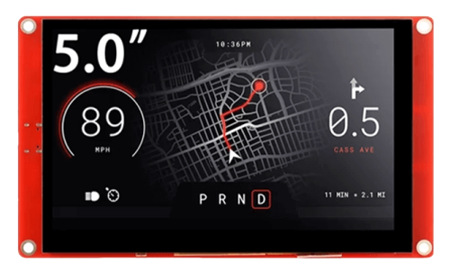
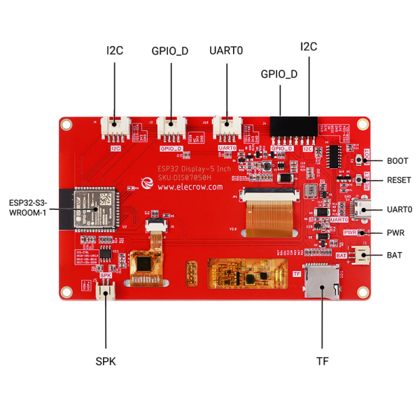
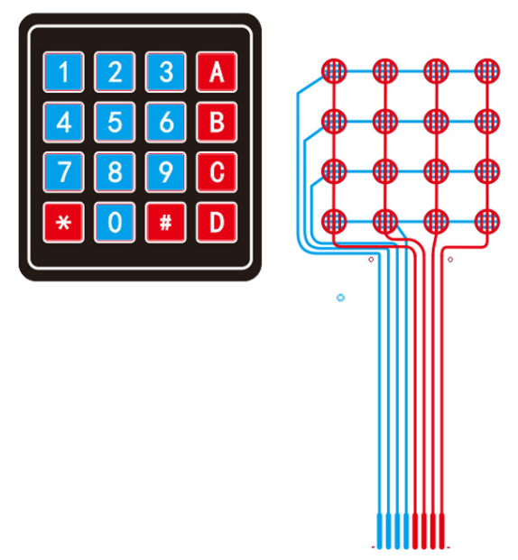
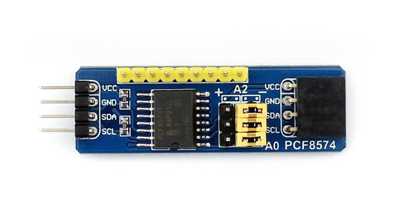
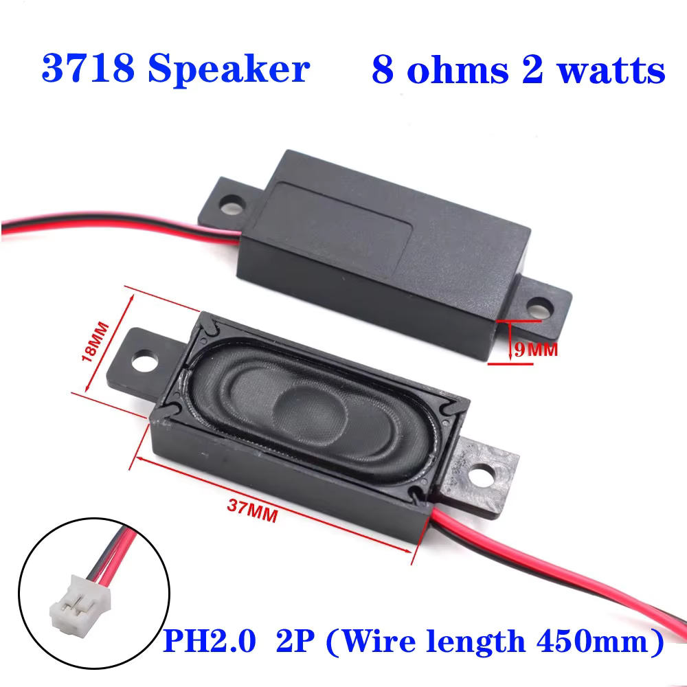

# ESP32 Voting Machine (WIP)

An Electronic Voting Machine with ESP32-S3, ESP-IDF and LVGL.

Key components:

- Elecrow board with 4 inch RGB display and ESP32-S3
- 4x4 membrane matrix keypad
- I2C IO expander for keypad
- Speaker
- REST API and Web interface for configuration
- SD Card to store data

## Elecrow board with 5 inch RGB display and ESP32-S3

[https://www.elecrow.com/esp32-display-5-inch-hmi-display-rgb-tft-lcd-touch-screen-support-lvgl.html](https://www.elecrow.com/esp32-display-5-inch-hmi-display-rgb-tft-lcd-touch-screen-support-lvgl.html)

 

The Elecrow 5 inch display board has the following ports available

|Port              | Pin Number |
|------------------|------------|
|GPIO_D            | IO38 |
|UART              | RX(IO44); TX(IO43) |
|I2C               | SDA(IO19); SCL(IO20) |
|Speaker (I2S)     | I2S-CTRL; I2S-LRCLK(IO18); I2S-BCLK(IO42); I2S-SDIN(IO17) |
|SD Card Slot (SPI)| MOSI(IO11); MISO(IO13); CLK(IO12); CS(IO10) |
|LCD Backlight     | IO2 |

## 4x4 Membrane Keypad

## PCF8574 I2C IO Expander

## Speaker

